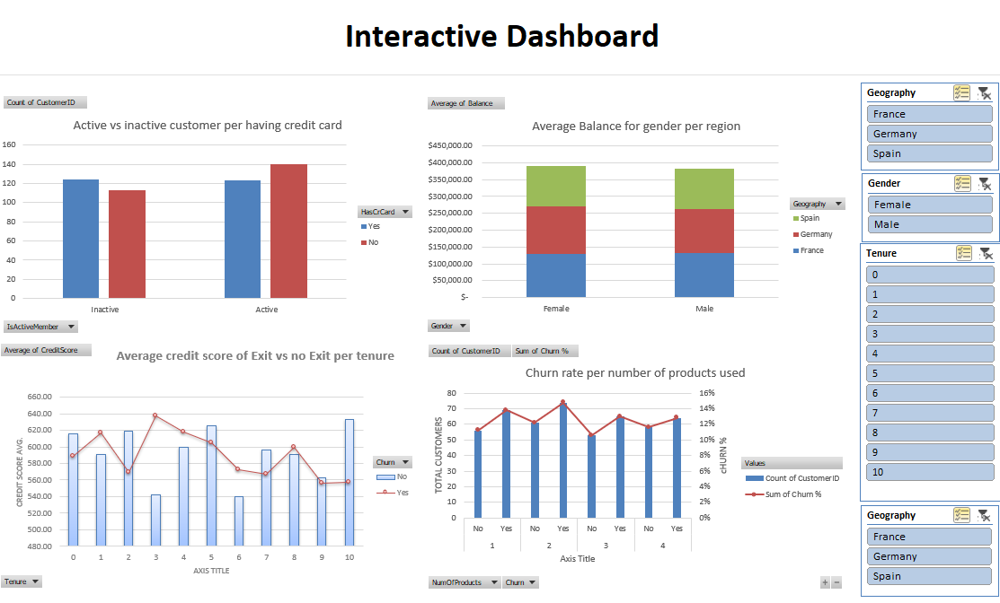

# Bank_churn_excel

Using Excel to analyze bank customers and understand factors contributing to customer churn.

Below if a screenshot of an interactive dashboard within Excel. We are using a sample of 500 rows from the original excel file which contains 10000.

## Going through the data using Excel. 

I found various insights and have documented the findings within the Excel file as well as below.

**1. What is the average credit score for each geography?**						

The Highest average credit score is $600.99 for Spain and the lowest being Germany with $579.69. While France is in the middle with $592.55.						
						

**2. How does the average account balance vary between genders within each country?**

The average account balance is higher for females compared to males. Where in total, females have $129,659.71 and males have $127,033.99.  Specifically in Germany where the highest average is $140,888.28 for females and the highest for males is located in France with an average of $133,204.76. Both males and females have the lowest account balance average in Spain where males have $119,667.18 and females have $120,986.24.					
					

**3. What is the distribution of active members versus non-active members according to having a credit card?**									

The distribution of active member according to have a credit is 123 people do have a credit card while active. However, 124 who are inactive do have a credit card. When looking at individuals who do not have a credit card more people are active with 140 being active without a credit card and 113 not active without a credit card.							
							

**4. What is the customer churn rate per number of products used?**							

For customers that used 1 product, the churn rate was 14%. For 2 products, it was 15%. For 3 it was 13% and 4 it was 13%. So the highest churn rate was for customers who used 2 products at 15% and the lowest was at 13% shared between 3 and 4 prodycts used.						
						
						
**5. What is the average credit score for customers who have exited compared to those who have stayed, across different tenure?**

The highest average credit score for customers across different tenures is 632 for customers who stayed for over 10 years and for customers who have left, the highest average was 637 at 3 years. While the lowest for those who stayed was at 540 at 6 years. And those that left, the lowest average was 556 at 9 years.					
					

     
## Dataset Description
This dataset contains information about 500 bank customers and is designed to help understand factors contributing to customer churn. The dataset includes the following variables:

**CustomerID**: A unique identifier for each customer.

**Surname**: The last name of the customer.

**CreditScore**: A score between 350 and 850 that represents the customer's creditworthiness.

**Geography**: The country or region where the customer resides (France, Spain, or Germany).

**Gender**: The customer's gender (Male or Female).

**Age**: The customer's age.

**Tenure**: The number of years the customer has been with the bank.

**Balance**: The customer's bank account balance.

**NumOfProducts**: The number of banking products the customer uses.

**HasCrCard**: Indicates whether the customer has a credit card with the bank (1 = Yes, 0 = No).

**IsActiveMember**: Indicates whether the customer is an active member (1 = Active, 0 = Inactive).

**EstimatedSalary**: The estimated salary of the customer.

**Churn**: Indicates whether the customer has left the bank (1 = Yes, 0 = No).

